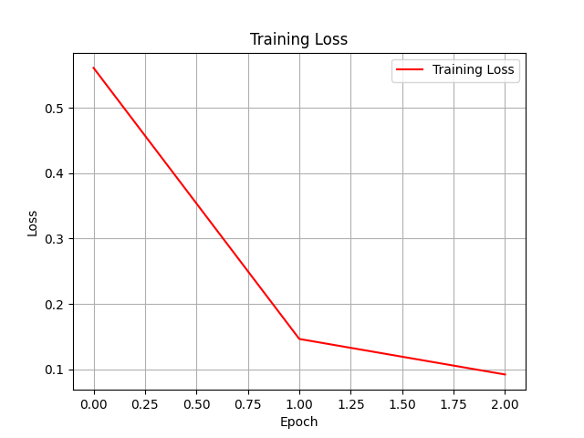
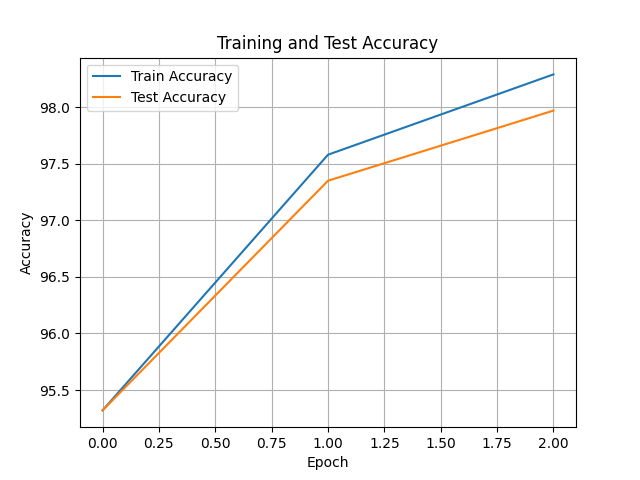

# LeNet-5 with NumPy from Scratch 🧠📊

In this project, the classic **LeNet-5** architecture is implemented entirely from scratch using only the **NumPy** library—without using any deep learning frameworks such as TensorFlow or PyTorch. The model is trained on the **MNIST** handwritten digit dataset.

## 🔧 Project Features

- CNN layers implemented with NumPy: Conv2D, MaxPool, Flatten, Dense  
- Activation functions: Tanh, Softmax ,Relu
- Loss: Cross Entropy Loss  
- Optimizer: Adam, Stochastic Gradient Descent (SGD)
- Manual implementation of forward and backward propagation  
- Visualization of training results (Loss & Accuracy)

---

## 📁 Project Structure

project/
│
├── data/ # MNIST dataset
├── layers/ # Layer implementations (Conv2D, Pooling, etc.)
├── model/ # LeNet-5 model (LNet5)
├── train.py # Training loop
├── utils.py # Utility functions
├── README.md # Project description
└── results/ # Graphs and output visualizations


---

## 🔍 Training Details 

- **Epochs**: 3  
- **Batch size**: 128 
- **Optimizer**: Adam  
- **Learning rate**: 0.001  

---

## 📉 Training Results

### 1. Loss Curve

Loss values recorded during training:



---

### 2. Accuracy Curve

Accuracy values recorded during training:



---

## 📦 Technologies Used

- Python 3.10+
- NumPy
- Matplotlib (for visualization only)

---

## 🧪 Getting Started

```bash
pip install numpy matplotlib
python main.py
